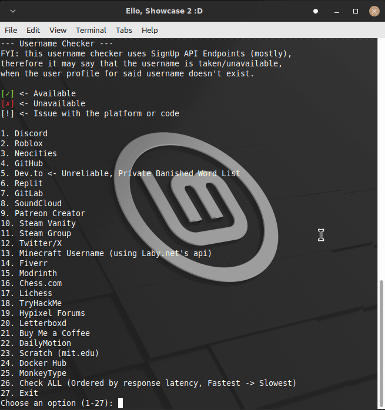

# Username Checker 🚀


---

## Why this tool exists

I originally wanted a simple username lookup tool.
If you search *“username lookup”*, the top result is [**Instant Username Search**](https://instantusername.com), which at first glance looks clean and reliable.

Then I read their [Terms of Service](https://instantusername.com/terms) — which explicitly state that they are **not liable for incorrect results**. That alone isn’t a dealbreaker, but it made me curious enough to inspect how their checks actually work.

The Roblox checker was the breaking point.

Their lookup links to:

```
https://www.roblox.com/user.aspx?username=<username>
```

This endpoint returns the **same response** for:

* available usernames
* terminated usernames
* certain invalid usernames

In other words:
**it cannot distinguish between “claimable” and “not claimable”.**

As a result, the tool effectively reports *every Roblox username* as taken, **regardless of reality. That isn’t unreliable - it’s structurally incorrect**.
But it isn't that bad if you don't mind some of the websites almost always returning 'unknown' or false positives/negatives, it's fast.

---

## Why profile lookup is the wrong approach

Profile-based username checks are fundamentally flawed because:

* Websites can (and do) return false responses when they detect scraping
* Profile pages often return identical responses for multiple states
* Existence ≠ availability (terminated, reserved, blocked, etc.)
* You cannot verify whether the site is telling the truth

If an endpoint cannot *theoretically* differentiate between states, no amount of retries or proxying will fix that.

---

## Why this tool uses signup APIs instead

This tool uses **signup / username validation APIs** wherever possible, because:

1. **They are more reliable than profile lookup**
2. **They are authoritative**

Signup APIs are constrained by a hard requirement:

> They cannot lie consistently without breaking account creation.

If a signup API falsely reports usernames as available or unavailable:

* either everyone could claim any username
* or nobody could sign up at all

Both outcomes would make the signup system unusable.

So when a signup API gives a definitive answer, that answer is real.

If a signup check fails, that’s not treated as “unknown” or guessed - it’s treated as **unavailable**, and the endpoint gets investigated or fixed later.

---

## Design philosophy

* Only return **“yes”** when the platform explicitly confirms availability
* Everything else is **“no”**
* No guessing
* No smoothing
* No profile scraping unless there is *literally no alternative*
* If an API changes and breaks, it gets fixed - not hidden.. unless if they make it GraphQL or something alike, then it might get hidden or changed.

This tool prioritizes **truth over UX**, even if that means fewer “yes” results.

---

## Contributing

If you find:
- a broken check
- incorrect behavior
- a better API approach

please open a GitHub issue or submit a pull request. Contributions are welcome.

---

## Extra stuffs
I probably wont do like releases on this unless if it's just the python script, since i'm on linux and i don't really want to try to compile for windows (or linux ngl) so yea, and i also wanna keep it open-source without 2 ways of running it.  

Also i think the requests library (``` pip install requests ```) (no it's not, check dependencies) is the only one you need to install so far.  

Oh also this project most likely will never be a publicly accessible website (or something alike) since it'd probably be very prone to timeouts/ratelimits and i dont like caching results (cause real-time results are better, even if slower). Also it's like this so you can run it yourself, also therefore there's not much risk for like my ip (example) to get banned if you like spam one or multiple of the APIs.  

if u want here's a [exposee markdown file](https://github.com/Evil3D/Username-Checker/blob/main/Exposees.md) which i may update occaisionally(mb if i misspelled)

---

## TL;DR  
I made username checker, which uses sign up APIs (or other official username APIs) instead of profile scraping/lookup (unless if that's the only option and i feel like it's accurate enough)  
It only says available/yes if the username is actually available, anything else - no/unavailable. Also no guessing for availability.  

---

## Dependencies
If ya read to the end, here are all the dependencies: (this exists cause i wanted it to and also links the projects to their pypi.org pages.)  
[Colorama](https://pypi.org/project/colorama/) - ``` pip install colorama ```  
[Requests](https://pypi.org/project/requests/) - ``` pip install requests ```

---

## Quick Start
(cause why not ig)
1. Clone the repo. (or just download the uh python script.. actually cloning might be better cause i added a requirements.txt.)
2. Install dependencies: `pip install requests colorama` (or ``` pip install -r requirements.txt ``` if you cloned the repo)  
2.5. **Note for Windows**: If pip doesn't work, try using `py -m pip install -r requirements.txt`.
3. Run: `python username_checker.py`

---

## Thy Backyard.. nono wait choose 1, Blacklist or Graveyard.. not 'Backyard'.. WHY NO-
This is where the rejected platforms go. If a site is here, it’s because their API is a nightmare, a privacy hazard, or just plain stupid.  

**Tiktok** <- Their signup endpoint is a privacy dumpster fire. It demands ~30 parameters including your Geo-IP, OS version, and browser metadata just to check a string. They basically try to fingerprint your soul before you even click "Sign Up."  
**Instagram/Facebook/Meta apps** <- They use GraphQL endpoints that are notoriously unstable for simple scripting. They also hide behind aggressive bot-detection (Cloudflare/Akamai) that returns a `401 Unauthorized` the second it detects you aren't a "real" high-trust browser.
